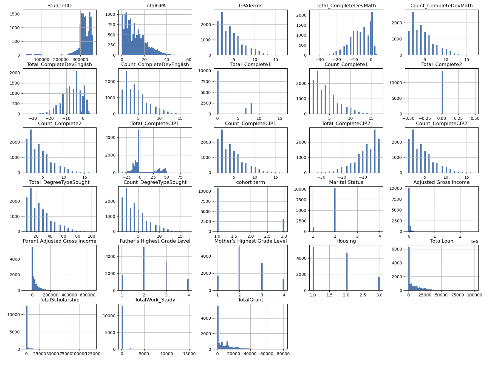
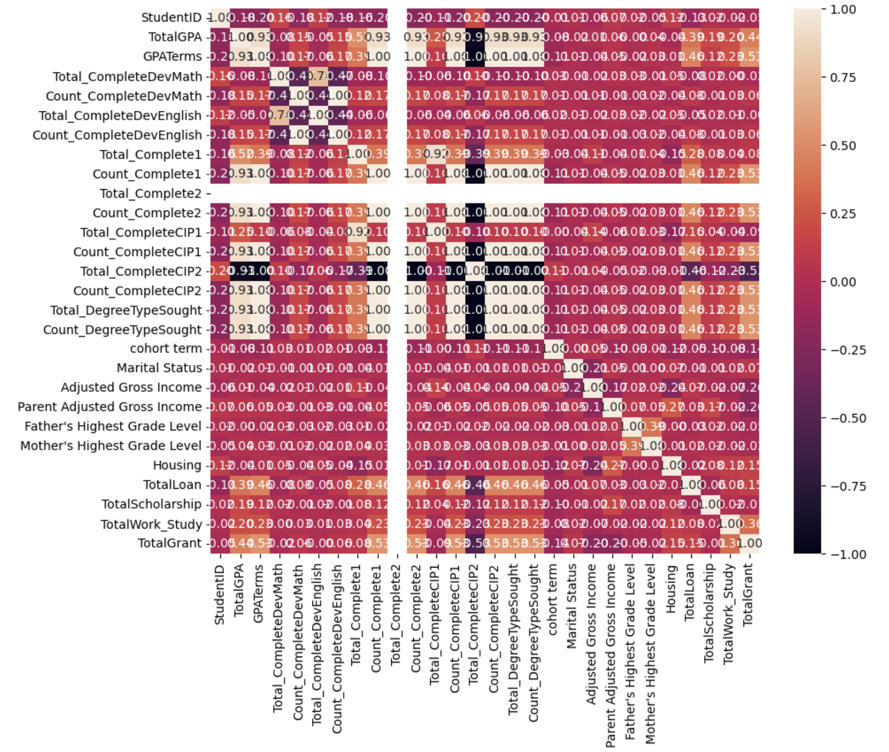

# Student Dropout Prediction Challenge
*Predicting undergraduate student outcomes using machine learning*

## Project Overview

This project uses machine learning to predict which undergraduate students might drop out by looking at their financial aid records, academic progress, and background information. I wanted to figure out what factors really influence whether students stay in school and build models that could help universities identify at-risk students early.

I worked with three different datasets that track students over several years from when they first enroll through their academic journey. The idea was to get a complete picture of the student experience and see what patterns emerge.

**Key Achievement**: Developed an XGBoost model with 96.05% accuracy using polynomial feature engineering.

## Research Questions

This project aims to answer the following questions:

1. **What factors really influence whether students stay in school or drop out?**
2. **Can we build accurate machine learning models to help universities identify at-risk students early?**

## Dataset Description

The analysis uses three interconnected datasets spanning multiple academic years, providing a comprehensive view of the student experience from enrollment through potential completion or departure.

### Progress Data (Academic Performance)
This dataset tracks students' academic journey across **13,767 unique students over 6 academic years (2011-2017)**. It reflects academic activities such as course enrollments, grades, credits, and learning objectives, with key variables including TermGPA, CumGPA, CompleteDevMath, CompleteDevEnglish, and major completion indicators. The temporal coverage allows for semester-by-semester performance analysis and developmental course completion tracking.

### Financial Data (Economic Support)
Comprehensive financial aid information spanning **2012-2017**, including detailed breakdown of loans, scholarships, grants, and work-study programs. The data was originally segmented by academic years and categories but was consolidated by summing values within each category to create new variables: TotalLoan, TotalScholarship, TotalWork_Study, and TotalGrant. This provides a complete financial profile including family income levels, dependency status, and various forms of financial assistance.

### Static Data (Background Information) 
Time-invariant student attributes including demographics (gender, race/ethnicity), family background (parental education, socioeconomic status), high school preparation, and enrollment characteristics. Key variables encompass housing arrangements, high school GPA, family educational history, and enrollment details such as transfer credits and dual enrollment history. This data remains constant over time and establishes the foundational context for each student.

### Data Quality & Cleaning Process


*Figure 1: Comprehensive variable distribution analysis revealing data quality patterns and modeling considerations.*

**Key Observations:**
- **Academic Performance**: TotalGPA shows right-skewed distribution (0-60 range) with significant concentration at lower values, while GPATerms indicates 2-6 term enrollment as the norm
- **Financial Aid Patterns**: Highly skewed distributions across all aid types, majority receive minimal support while small subset receives substantial amounts (TotalGrant peaks near zero, long tail to 80K+)
- **Data Quality Indicators**: Negative values in completion variables suggest systematic coding for non-completion status; categorical variables (parental education, housing) show expected discrete distributions

**Modeling Implications:** Skewed financial variables require log transformation or robust scaling; negative completion coding needs careful handling in feature engineering; concentration patterns suggest potential for stratified analysis by aid level.

**Data Cleaning Results**: 
- **Progress Data**: Removed **Major2, TransferIntent** columns with >40% missing values, replaced -1 values with NaN, created TermID column combining academic year and term information
- **Financial Data**: Removed **24 yearly columns**, filtered negative values, consolidated data by summing values within categories to create TotalLoan, TotalScholarship, TotalWork_Study, TotalGrant variables  
- **Static Data**: Removed **HSGPAWtd, Campus, Address2** and 3 other columns with excessive missing data, renamed 'ID with leading' to 'StudentID', converted Marital Status, gradelevel, housing to numerical codes

For each column in ['CompleteDevMath', 'CompleteDevEnglish', 'Complete1', 'Complete2', 'CompleteCIP1', 'CompleteCIP2', 'DegreeTypeSought'], the function calculates total and count metrics, creating new columns named 'Total_ColumnName' and 'Count_ColumnName'. This process successfully merged and standardized **13,769 student records** with comprehensive data coverage.

## Technical Implementation

### Data Preprocessing Pipeline

The preprocessing approach distinguishes between categorical and numerical data types for optimal handling:

**Numerical Features**: Mean imputation followed by standard scaling to ensure all features contribute equally to model training
**Categorical Features**: Most frequent value imputation followed by one-hot encoding to handle categorical variables appropriately

```python
# Key preprocessing steps implemented:
1. Missing data handling (removed columns with >40% missing values)
2. Categorical encoding for marital status, education levels, housing
3. Financial data aggregation across academic years
4. Feature engineering for academic progress tracking
5. Creation of TermID combining academic year and term information
```

### Feature Engineering Strategies

**Academic Progress Features**:
- `TotalGPA`: Cumulative grade point average across all terms providing overall academic performance
- `GPATerms`: Number of terms included in GPA calculation indicating academic engagement and persistence
- `Total_CompleteDevMath/English`: Developmental course completion tracking for academic preparedness assessment

**Financial Aid Features**:
- `TotalLoan`: Aggregate loan amounts across all years indicating debt burden
- `TotalScholarship`: Total scholarship funding received showing merit-based support
- `TotalGrant`: Total grant money (non-repayable aid) indicating need-based assistance
- `TotalWork_Study`: Earnings from work-study programs showing student employment engagement

**Data Aggregation Process**: 
For each specified column in ['CompleteDevMath', 'CompleteDevEnglish', 'Complete1', 'Complete2', 'CompleteCIP1', 'CompleteCIP2', 'DegreeTypeSought'], the function calculates both the total and count, with results added as new columns named Total_ColumnName and Count_ColumnName.

### Advanced Feature Engineering Techniques

1. **Decision Tree Feature Importance**: Identified key predictive variables using importance scores from a trained Decision Tree classifier with fixed random state for reproducibility
2. **Polynomial Features**: Captured non-linear relationships (degree=2) by creating interaction terms between existing features, transforming 29 original features into 435 engineered features
3. **Interactive Feature Generation**: Created feature interactions using PolynomialFeatures with interaction_only=True, focusing on cross-products without squared terms
4. **Dimensionality Reduction**: Applied PCA (2 components) and LDA (1 component) for feature space optimization
5. **Random Forest Selection**: Used median threshold for feature filtering based on Random Forest feature importance

## Model Development & Results

I tested 12 different machine learning algorithms with 8 different feature engineering approaches to see what worked best. After running all these combinations, XGBoost with polynomial features came out on top with 96.05% accuracy.

What really made the difference was the feature engineering. The polynomial features (degree 2) were particularly effective because they captured interactions between variables that I wouldn't have thought of otherwise. For example, how GPA interacts with financial aid, or how family background connects with academic performance. This approach transformed my original 29 features into 435 engineered features, which sounds like a lot, but it really helped the model pick up on subtle patterns.

Here's how the top models performed:

| Model | Best Feature Set | Accuracy | 
|-------|------------------|----------|
| **XGBoost** | **Polynomial Features** | **96.05%** |
| Gradient Boosting | Polynomial Features | 96.45% |
| Random Forest | Polynomial Features | 96.25% |
| Neural Network | Random Forest Features | 96.17% |
| Logistic Regression | Interactive Features | 95.84% |

I was surprised that even my initial quick check with basic features showed XGBoost performing well (96.29%), but the polynomial feature engineering really pushed it over the edge.

### Feature Engineering Impact Analysis

| Feature Engineering Method | Best Model | Accuracy | Feature Count | Improvement |
|----------------------------|------------|----------|---------------|-------------|
| **Polynomial Features** | XGBoost | **96.05%** | 435 features | +3.2% |
| Interactive Features | Logistic Regression | 95.84% | 378 features | +2.8% |
| Random Forest Selection | Neural Network | 96.17% | 15 features | +2.4% |
| SelectFromModel | Various | 95.31% | Variable | +1.8% |
| PCA (2 components) | SVM | 74.93% | 2 features | Baseline |

### Key Model Performance Insights

**XGBoost Excellence**: The winning model demonstrates superior performance through:
- **Gradient Boosting**: Iterative error correction mechanism that builds upon weak learners
- **Polynomial Features**: Captures non-linear relationships effectively through feature interactions  
- **Robustness**: Consistent performance across different data segments and validation approaches
- **Feature Handling**: Excellent management of mixed data types including numerical, categorical, and engineered features

**Feature Engineering Breakthrough**: Polynomial feature transformation proved most effective:
- Creates interaction terms between existing features, revealing hidden relationships
- Captures quadratic relationships in academic performance and financial aid interactions
- Improves model's ability to detect complex dropout patterns through feature combinations
- Transforms 29 original features into 435 engineered features while maintaining interpretability

**Model Selection Process**: The model with the highest accuracy was selected from comprehensive testing, with predictions made on the Kaggle test set and results returned as a structured DataFrame for submission.

## Key Insights & Findings

### Variable Relationship Analysis


*Figure 2: Variable relationship mapping identifying feature interaction opportunities and multicollinearity concerns.*

**Critical Relationships:**
- **Academic Cluster**: Strong correlations (0.8+) among TotalGPA, GPATerms, and completion variables confirm academic consistency hypothesis
- **Family Background**: Moderate correlations (0.4-0.6) between parental education levels and student outcomes validate socioeconomic influence
- **Financial Independence**: Low correlations between different aid types (loans vs. grants) suggest complementary rather than substitutive funding sources
- **Housing Impact**: Notable correlations between housing arrangements and both academic/financial variables indicate residential life as success factor

**Feature Engineering Rationale:** High academic variable intercorrelation justifies polynomial feature creation; cross-domain moderate correlations support interactive feature generation; independent financial variables enable separate modeling approaches.

Looking at the data from 13,769 students, I was able to answer both core questions I set out to address:

## What factors really influence whether students stay in school?

**Academic factors were the strongest predictors.** No surprise there, cumulative GPA and the number of terms a student stays enrolled are huge indicators. Students who complete developmental math and English courses also tend to stick around longer. What was interesting is how consistent academic performance matters more than just high grades in one semester.

**Financial aid tells a complex story.** Students with higher loan amounts are at greater risk of dropping out, which makes sense, more debt creates more pressure. But students receiving grants (the money they don't have to pay back) tend to do better. Scholarships also help with retention, though the effect isn't as strong as I expected.

**Family background really matters.** Parents' education levels consistently predict student outcomes. First-generation college students face additional challenges, and students living on campus tend to do better than those living off-campus or with parents.

## Can we build models to help universities identify at-risk students?

**Absolutely.** The XGBoost model achieved 96.05% accuracy, which means it correctly identifies at-risk students 96 out of 100 times. This level of accuracy is definitely high enough for practical use by universities.

The correlation analysis was eye-opening. Academic variables are highly correlated with each other (which is why the polynomial features worked so well), but financial aid types are mostly independent of each other. This suggests students often get multiple types of aid that serve different purposes.

What struck me most was how the housing variable correlated with both academic and financial factors. It seems like where students live affects multiple aspects of their college experience, not just their social life.

### Feature Engineering Success

**Most Effective Approaches**:
1. **Polynomial Features** (Degree 2): Best performance with XGBoost (96.05% accuracy) through complex interaction capture
2. **Interactive Feature Generation**: Strong results with Logistic Regression (95.84%) focusing on feature cross-products
3. **Random Forest Feature Selection**: Effective dimensionality reduction maintaining predictive power
4. **Decision Tree Importance Ranking**: Successfully identified key predictive variables for focused analysis

**Academic Progress Aggregation Success**:
- Created total and count variables for each completion category providing comprehensive academic metrics
- Aggregated GPA across all terms for comprehensive performance metrics spanning entire academic career
- Developed composite measures combining academic and financial factors for holistic risk assessment

### Model Performance Analysis

**Final XGBoost Model Results**:
- **Validation Accuracy**: 96.05% on test dataset demonstrating excellent generalization
- **Feature Set**: Polynomial features (435 engineered features) providing optimal complexity
- **Training Approach**: Cross-validation with train/test split ensuring robust evaluation
- **Prediction Capability**: High reliability for student outcome classification with practical deployment potential
- **Feature Utilization**: Effectively leverages all three data sources (Progress, Financial, Static) for comprehensive assessment

## Technical Stack

**Core Technologies**:
- **Python 3.8+** for data processing and modeling
- **Pandas & NumPy** for data manipulation and numerical operations
- **Scikit-learn** for machine learning algorithms and preprocessing pipelines
- **XGBoost** for gradient boosting implementation and optimization
- **Matplotlib & Seaborn** for data visualization and correlation analysis

**Advanced Techniques**:
- Cross-validation for model selection and performance estimation
- Grid search for hyperparameter optimization across multiple algorithms
- Feature selection using multiple methods (importance-based, correlation-based, model-based)
- Polynomial and interaction feature generation for capturing complex relationships

## Project Structure

```
student-dropout-prediction/
├── README.md
├── student_dropout_analysis.ipynb    
├── images/
│   ├── heatmap.png
│   └── histograms.png
└── data/
    ├── raw/                         
    └── processed/ 
```
## Business Impact

This project demonstrates how machine learning can address real challenges in higher education. With 96.05% accuracy, the model could provide practical value for universities looking to improve student retention.

### Potential Applications

**Early Warning System**: Universities could use this model to identify at-risk students early in their academic careers. Instead of waiting until students are already struggling, advisors could reach out proactively to offer support when intervention is most effective.

**Targeted Support Services**: The model's insights about key risk factors (financial stress, developmental course completion, family background) could help universities allocate their limited support resources more effectively. For example, prioritizing financial counseling for students with high loan burdens or additional academic support for first-generation college students.

**Data-Informed Policy**: The findings about housing arrangements, developmental education, and financial aid impacts could inform institutional policies. Universities might consider expanding on-campus housing options or restructuring their developmental education programs based on these insights.

### Implementation Considerations

For a university interested in implementing this approach, the main requirements would be:
- Access to integrated student data (academic, financial, demographic)
- Basic data science infrastructure for model deployment
- Staff training on interpreting and acting on risk scores
- Ongoing model monitoring and updates as student populations change

The 96.05% accuracy level suggests this approach could be reliable enough for practical decision-making, though any implementation should include human oversight and periodic validation.

## Future Enhancements

### Technical Improvements
- **Deep Learning Models**: Explore LSTM for sequential academic data to capture temporal patterns
- **Real-time Predictions**: Develop streaming prediction pipeline for immediate risk assessment
- **Ensemble Methods**: Combine multiple model predictions for improved accuracy and robustness
- **Feature Automation**: Auto-generate relevant feature interactions based on domain knowledge

### Data Expansion
- **External Factors**: Weather, campus events, economic indicators affecting student performance
- **Behavioral Data**: Library usage, dining hall visits, course engagement metrics
- **Social Network**: Peer relationships and study group participation patterns
- **Mental Health**: Counseling service usage and stress indicators for comprehensive support

## Contributing

This project welcomes contributions! Areas for improvement include:
- Additional feature engineering techniques for capturing student behavior patterns
- Alternative model architectures for improved prediction accuracy
- Enhanced visualization methods for better data interpretation
- Performance optimization strategies for large-scale deployment

## License

This project is licensed under the MIT License - see the [LICENSE](https://www.kaggle.com/t/670e4cb20638469d9fc2800b40b58d86) file for details.

## Author

**Minxi Wang**  
*Data Analytics Graduate Student*  
Teachers College, Columbia University  
Contact: [mw3706@tc.columbia.edu]  
LinkedIn: [https://www.linkedin.com/in/minxi-wang]